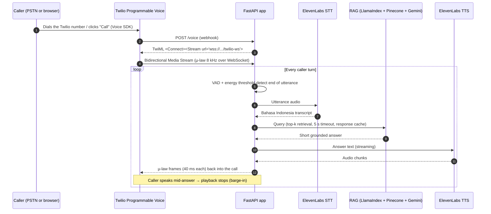

# Bahasa Indonesia Voice AI Agent on Twilio

A real-time voice agent that answers phone calls in **Bahasa Indonesia**, grounded in a company's own documents. Callers dial a Twilio number (or use a browser softphone), ask a question in natural speech, and hear a short, spoken answer drawn from uploaded PDFs: policies, FAQs, product sheets.

Built as a proof of concept for Indonesian customer-service teams, where most off-the-shelf voice AI is tuned for English first.

> **Status:** proof of concept. It runs end to end on live phone calls, but it is not production-hardened (see [Production readiness](#production-readiness)).

---

## Why this exists

Indonesian contact centres handle high call volumes in Bahasa Indonesia, and most of those calls are repeat questions whose answers already sit in a document somewhere. This PoC tests one idea: **can a caller get a correct, natural-sounding answer from the company's own knowledge base, in their own language, without waiting for an agent?**

The design goal was a conversation that *feels* like talking to a person:

- **The agent knows when you've finished speaking** (voice-activity detection, not a fixed silence timer).
- **You can interrupt it** (barge-in: the agent stops talking the moment the caller speaks).
- **It never goes silent** (if retrieval is slow, it says so politely instead of dead air).
- **Answers are short** (two sentences maximum, because nobody wants a paragraph read to them over the phone).

---

## How a call flows



---

## What's inside

| Layer | Implementation |
|---|---|
| **Telephony** | Twilio Programmable Voice webhook (`/voice`) returning TwiML `<Connect><Stream>`; every webhook verifies the `X-Twilio-Signature` header (proxy-aware, so it works behind ngrok or a load balancer) |
| **Browser calling** | Twilio Voice SDK softphone; `/twilio-token` issues an Access Token with a `VoiceGrant` bound to a TwiML App |
| **Real-time audio** | Twilio **Media Streams**: bidirectional WebSocket (`/twilio-ws`), µ-law 8 kHz, sent back in 320-byte / 40 ms frames |
| **Turn-taking** | WebRTC VAD (aggressiveness 2) combined with an energy threshold tuned for 8 kHz telephony audio |
| **Barge-in** | Caller speech during playback cancels the outbound TTS stream immediately |
| **Speech-to-text** | ElevenLabs Scribe (multilingual, handles Bahasa Indonesia) |
| **Knowledge retrieval** | LlamaIndex over a Pinecone vector index; Gemini embeddings; PDFs ingested via `/upload-pdf` (PyMuPDF) |
| **Answer generation** | Gemini Flash with a Bahasa Indonesia customer-service prompt: polite, honest when the answer isn't in the documents, max two sentences |
| **Text-to-speech** | ElevenLabs multilingual model, **streamed** so the caller hears the start of the answer before synthesis finishes |
| **Latency engineering** | Per-stage timing instrumentation, TTL response cache, HTTP connection reuse, 5-second retrieval timeout with a spoken fallback |

---

## Design decisions worth calling out

**Media Streams over ConversationRelay, deliberately.** Twilio ConversationRelay provides STT, TTS, and interruption handling as a managed layer, and it is the right default for many voice agents. This project builds on raw Media Streams instead, for two reasons:

- **Full control over speech quality in Bahasa Indonesia.** Owning the pipeline means choosing the STT and TTS providers that handle Indonesian accents, slang, and code-switching between Indonesian and English best, and swapping them stage by stage as better models appear, rather than relying on a managed speech layer.
- **Room for speech-native AI models.** Direct access to raw call audio keeps the door open to real-time voice AI and speech-to-speech models, which consume audio directly instead of going through a text round-trip. That keeps the architecture current as voice AI evolves.

The trade-off is more code to own (VAD, barge-in, framing), which is the part of this repo worth reading.

**Short answers by design.** The prompt caps answers at two sentences. On a phone call, brevity is a feature: a long answer costs the caller time and raises the chance they interrupt anyway.

**Fail politely, never silently.** Retrieval has a hard timeout. If it trips, the caller hears a graceful spoken fallback rather than silence, which is what makes callers hang up.

**One knowledge base, three ways in.** The same RAG core serves a phone number, a Twilio browser softphone, and a plain browser WebSocket demo (`/voice-call`, `/ws`), so a stakeholder can test it from a laptop without dialling.

---

## Running it

**Prerequisites:** Python 3.11 or 3.12 (the code uses `audioop`, removed in 3.13), ffmpeg, a Twilio account with a voice-capable number, and API keys for ElevenLabs, Pinecone, and Google Gemini.

```bash
python -m venv .venv && source .venv/bin/activate   # Windows: .venv\Scripts\activate
pip install -r requirements.txt
cp .env.example .env                                  # then fill in your keys
uvicorn app:app --host 0.0.0.0 --port 8000
```

Expose the app over HTTPS (e.g. `ngrok http 8000`), then in the Twilio Console:

1. Set your phone number's **Voice webhook** to `https://<your-host>/voice` (HTTP POST).
2. Create a **TwiML App** pointing at `https://<your-host>/twiml` for the browser softphone, and put its SID in `.env`.
3. Upload a PDF at `/` and call the number.

### Environment variables

| Variable | Purpose |
|---|---|
| `TWILIO_ACCOUNT_SID`, `TWILIO_AUTH_TOKEN` | Twilio account credentials |
| `TWILIO_API_KEY`, `TWILIO_API_SECRET` | API key pair used to mint Voice SDK access tokens |
| `TWILIO_TWIML_APP_SID` | TwiML App for browser calling |
| `TWILIO_PHONE_NUMBER` | Caller ID / inbound number |
| `TWILIO_VALIDATE_SIGNATURE` | `true` by default; set `false` only for local tests without Twilio |
| `ELEVENLABS_API_KEY` | Speech-to-text and text-to-speech |
| `PINECONE_API_KEY`, `PINECONE_INDEX_NAME` | Vector store |
| `GEMINI_API_KEY` | Embeddings and answer generation |

---

## Production readiness

This is a PoC. Before putting real customers on it, I would add:

- **Endpoint auth:** protect the admin endpoints `/upload-pdf`, `/clear-cache`, and `/index-stats` (Twilio webhooks are already signature-verified).
- **Human handoff:** a `<Dial>` / TaskRouter transfer to a live agent when confidence is low or the caller asks for a person, which is where Twilio Flex fits.
- **Data handling:** PII redaction in transcripts and logs, and a retention policy for call audio.
- **Evaluation:** a golden-question set in Bahasa Indonesia scored on answer correctness and retrieval relevance, used as a release gate.
- **Observability:** export the existing per-stage timings to metrics and alert on p95 response time.

---

